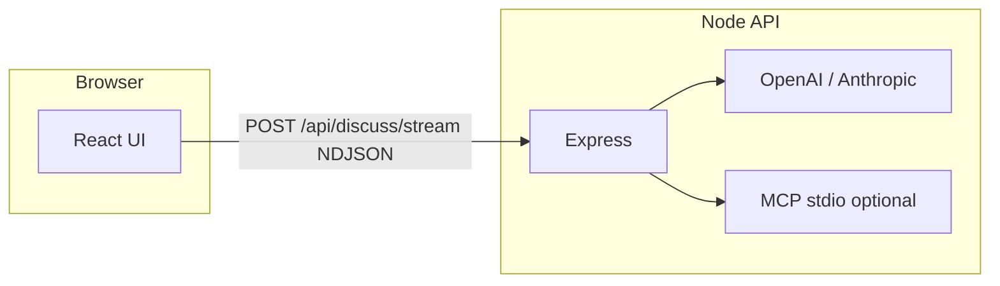

# StoryOS — Multi-Agent AI Discussion Framework

> Ship a multi-agent AI app in under 10 minutes.

**[Live demo](https://storyos.vercel.app)** · **[Gumroad](https://gumroad.com/l/storyos-template)** · **[Lemon Squeezy](https://lemonsqueezy.com)** (create a product and paste your URL) · **[Discord](https://discord.gg)** (replace with your invite)

StoryOS is an **Express + React** boilerplate: three agents answer **in parallel**, stream **NDJSON** to the browser, support **OpenAI and Anthropic**, optional **MCP tools**, **bounded self-refinement**, and **pinned insights** the user controls.

---

## What you get

- Multi-agent discussion panel (3 agents, parallel execution)
- Pluggable LLMs (OpenAI + Anthropic, same codebase)
- MCP tool integration (stdio servers on long-running Node hosts)
- Bounded self-refinement loop (0–3 rounds via `SELF_IMPROVE_MAX_ROUNDS`)
- Pinned insights (no opaque model memory lock-in)
- Vercel-ready deployment (API routes included; MCP is local/long-running only)

---

## 5-minute setup

```bash
git clone <your-repo-url> storyos && cd storyos
npm install
cp .env.example .env
# Edit .env — set OPENAI_API_KEY (or Anthropic — see .env.example)

npm run dev:all
```

- **App:** http://localhost:5173 (Vite proxies `/api` → `http://localhost:3001`)
- **API only:** `npm run server` → http://localhost:3001

**Placeholder screenshots** (swap for real PNG/WebP before launch — see **[docs/SCREENSHOTS.md](./docs/SCREENSHOTS.md)**):

| Home | Live panel | Env hint (docs) |
|------|------------|-----------------|
|  |  |  |

See **[SETUP_GUIDE.md](./SETUP_GUIDE.md)** for buyers and **[CUSTOMIZATION.md](./CUSTOMIZATION.md)** to change agents, tools, and prompts. **Before you sell:** **[docs/PUBLISH_CHECKLIST.md](./docs/PUBLISH_CHECKLIST.md)**.

---

## Architecture



- **UI:** `src/components/DiscussionStudio.jsx` — health check, stream consumer, pinned insights.
- **API factory:** `server/createApp.js` — CORS, tools, `/api/health`, discuss route.
- **Agents & prompts:** `server/agents.js`, shared rules in `server/discussStream.js`.
- **Built-in tools:** `server/tools/builtin.js`.
- **Vercel:** `api/*.js` + `server/getApp.js` reuse the same app (no MCP on serverless).

---

## Customization (quick pointers)

| Goal | Where |
|------|--------|
| New agent persona | `server/agents.js` + mirror labels in `DiscussionStudio.jsx` |
| New built-in tool | `server/tools/builtin.js` (handler + OpenAI schema) |
| MCP server | `MCP_SERVERS` in `.env` — see `.env.example` |
| Panel / transcript prompts | `server/discussStream.js` (`streamOne` system string) |

Full walkthrough: **[CUSTOMIZATION.md](./CUSTOMIZATION.md)**.

---

## Scripts

| Command | Purpose |
|---------|---------|
| `npm run dev` | Vite only |
| `npm run dev:all` | API + Vite |
| `npm run server` | API only |
| `npm run build` | Production UI → `dist/` |
| `npm run lint` / `npm run ci` | ESLint + build |

---

## Production

- **Same-origin (Vercel):** set secrets in the dashboard (`OPENAI_API_KEY`, etc.). Do **not** set `VITE_API_BASE_URL` if the UI calls `/api` on the same host. **`MCP_SERVERS` is ignored on Vercel** (stdio needs a long-running process).
- **Split deploy:** host `server/index.js` elsewhere, set `CORS_ORIGIN`, point the UI with `VITE_API_BASE_URL`.

Details remain in deployment comments inside **[SETUP_GUIDE.md](./SETUP_GUIDE.md)**.

---

## Marketing page (optional)

Static landing (dark / dev aesthetic): **[`/landing.html`](./public/landing.html)** — after `npm run dev`, open http://localhost:5173/landing.html

---

## FAQ

**Can I use this on Vercel’s free plan?**  
Yes for the UI + API routes; watch serverless **max duration** on long streams. MCP needs a non-serverless host.

**Does it work with models other than OpenAI?**  
Yes — set `LLM_PROVIDER=anthropic` and `ANTHROPIC_API_KEY` (see `.env.example`).

**Can I use this in a commercial project?**  
Yes. See **[LICENSE](./LICENSE)** — commercial use is allowed; **resale/redistribution of the source as a template product is not**. This is not legal advice; use **[docs/PUBLISH_CHECKLIST.md](./docs/PUBLISH_CHECKLIST.md)** and consult a lawyer if you need custom terms.

**Gumroad or Lemon Squeezy?**  
Either works for digital delivery (zip + license). StoryOS doesn’t depend on one vendor — link whichever checkout you use in **README** and **`public/landing.html`**.

**What if I forget my API key?**  
Local: the server exits on startup with a list of missing variables. The UI reads `/api/health` and shows **which** key is missing when `ai: false`.

**What is AgentOS mode?**  
Optional hook: set `STORYOS_MODE=agentOS` and `AGENTOS_WEBHOOK_URL` to POST each finished panel round to your approval queue. See **[docs/AGENTOS.md](./docs/AGENTOS.md)**.

---

## More docs

- **[SETUP_GUIDE.md](./SETUP_GUIDE.md)** — install, checklist, common mistakes  
- **[CUSTOMIZATION.md](./CUSTOMIZATION.md)** — agents, tools, prompts  
- **[docs/AGENTOS.md](./docs/AGENTOS.md)** — AgentOS webhook + env  
- **[docs/SCREENSHOTS.md](./docs/SCREENSHOTS.md)** — product-page captures  
- **[docs/PUBLISH_CHECKLIST.md](./docs/PUBLISH_CHECKLIST.md)** — pre-launch for sellers  
- **[PROJECT_CONTEXT.md](./PROJECT_CONTEXT.md)** — narrative demo context  
- **[docs/RESEARCH_AND_GOVERNANCE.md](./docs/RESEARCH_AND_GOVERNANCE.md)** — governance lens  

---

## AgentOS mode (optional)

Use StoryOS as a **live demo shell** that forwards each completed panel round to your queue:

1. **UI:** set **`VITE_MODE=agentOS`** in `.env` — the live panel shows an **AgentOS** badge (rebuild the frontend after changing).
2. **Server:** set **`STORYOS_MODE=agentOS`**, **`AGENTOS_WEBHOOK_URL`**, and optionally **`AGENTOS_WEBHOOK_SECRET`** — after the NDJSON stream finishes, the API **POSTs** JSON with `topic`, `userMessage`, `panelMemory`, `agents` (final text per id), `provider`, `model`, `at`.

Details and payload shape: **[docs/AGENTOS.md](./docs/AGENTOS.md)**.
